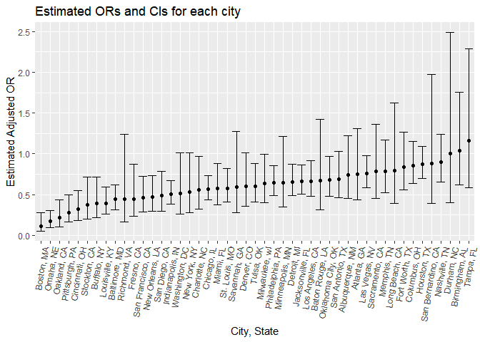
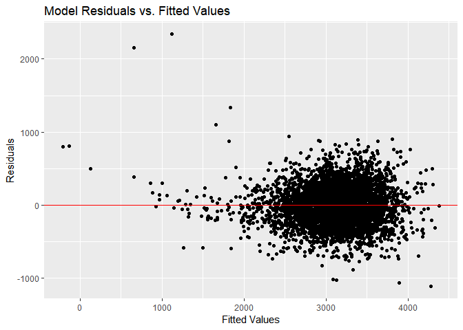

p8105\_hw6\_yg2625
================
Yue Gu
November 25, 2018

Library
=======

``` r
library(tidyverse)
```

Problem 1
=========

Import data
-----------

``` r
homi_raw = read_csv("https://raw.githubusercontent.com/washingtonpost/data-homicides/master/homicide-data.csv")
head(homi_raw, 10)
```

    ## # A tibble: 10 x 12
    ##    uid   reported_date victim_last victim_first victim_race victim_age
    ##    <chr>         <int> <chr>       <chr>        <chr>       <chr>     
    ##  1 Alb-~      20100504 GARCIA      JUAN         Hispanic    78        
    ##  2 Alb-~      20100216 MONTOYA     CAMERON      Hispanic    17        
    ##  3 Alb-~      20100601 SATTERFIELD VIVIANA      White       15        
    ##  4 Alb-~      20100101 MENDIOLA    CARLOS       Hispanic    32        
    ##  5 Alb-~      20100102 MULA        VIVIAN       White       72        
    ##  6 Alb-~      20100126 BOOK        GERALDINE    White       91        
    ##  7 Alb-~      20100127 MALDONADO   DAVID        Hispanic    52        
    ##  8 Alb-~      20100127 MALDONADO   CONNIE       Hispanic    52        
    ##  9 Alb-~      20100130 MARTIN-LEY~ GUSTAVO      White       56        
    ## 10 Alb-~      20100210 HERRERA     ISRAEL       Hispanic    43        
    ## # ... with 6 more variables: victim_sex <chr>, city <chr>, state <chr>,
    ## #   lat <dbl>, lon <dbl>, disposition <chr>

Data manipulation
-----------------

-   Create a city\_state variable, and a binary variable
-   Omit cities Dallas, TX; Phoenix, AZ; and Kansas City, MO; Tulsa, AL
-   Modifiy victim\_race to have categories white and non-white
-   Transform victim\_age as numeric

``` r
homi_create = 
  homi_raw %>% 
  mutate(city_state = paste(city, state, sep = ", "),
         solved = ifelse(disposition == "Closed without arrest" | disposition == "Open/No arrest", 0, 1)) %>% 
  filter(city_state != "Dallas, TX" , city_state != "Phoenix, AZ", city_state != "Kansas City, MO", city_state != "Tulsa, AL") %>% 
  mutate(victim_race = ifelse(victim_race == "White", "white", "nonwhite"),
         victim_race = fct_relevel(victim_race, "white"),
         victim_age = as.numeric(victim_age))
```

    ## Warning in evalq(as.numeric(victim_age), <environment>): NAs introduced by
    ## coercion

``` r
class(homi_create$victim_age)
```

    ## [1] "numeric"

``` r
class(homi_create$victim_race)
```

    ## [1] "factor"

As required, binary variable *solved* have value 0 if the case is unsolved, have value 1 if the case is solved, *victim\_race* have categories white and non-white as factors and *victim\_age* are numeric.

Fit regression
--------------

-   For the city of Baltimore, MD, use the glm function to fit a logistic regression with resolved vs unresolved as the outcome and victim age, sex and race as predictors
-   Save the output of glm as an R object

``` r
fit_log_balt = 
  homi_create %>% 
  filter(city_state == "Baltimore, MD") %>% 
  glm(solved ~ victim_age + victim_sex + victim_race, data = ., family = binomial())
```

-   Apply the broom::tidy to this object
-   Obtain the estimate and confidence interval of the adjusted odds ratio for solving homicides comparing non-white victims to white victims keeping all other variables fixed

``` r
fit_log_balt %>% 
  broom::tidy() %>%
  mutate(OR = exp(estimate),
         OR_low = exp(estimate - qnorm(1-0.05/2)*std.error),
         OR_high = exp(estimate + qnorm(1-0.05/2)*std.error)) %>%
  select(term, estimate, OR, OR_low, OR_high) %>% 
  knitr::kable(digits = 3)
```

| term                 |  estimate|     OR|  OR\_low|  OR\_high|
|:---------------------|---------:|------:|--------:|---------:|
| (Intercept)          |     1.186|  3.274|    2.067|     5.186|
| victim\_age          |    -0.007|  0.993|    0.987|     0.999|
| victim\_sexMale      |    -0.888|  0.412|    0.315|     0.537|
| victim\_racenonwhite |    -0.820|  0.441|    0.313|     0.620|

With the output, we could know the adjusted odds ratio for solving homicides comparing non-white victims to white victims is 0.441 keep all else fixed. And we are 95% confident that the adjusted odds ratio will fall in the range from 0.313 to 0.620.

-   Run glm for each of the cities in your dataset, and extract the adjusted odds ratio (and CI) for solving homicides comparing non-white victims to white victims

``` r
fit_log_all =
  homi_create %>% 
  group_by(city_state) %>% 
  nest() %>% 
  mutate(models = map(data, ~glm(solved ~ victim_age + victim_sex + victim_race, data = ., family = binomial())),
         models = map(models, broom::tidy)) %>% 
  select(-data) %>% 
  unnest() %>% 
  filter(term == "victim_racenonwhite") %>%
  mutate(OR = exp(estimate),
         OR_low = exp(estimate - qnorm(1-0.05/2)*std.error),
         OR_high = exp(estimate + qnorm(1-0.05/2)*std.error)) %>% 
  select(-term, -std.error, -p.value, - statistic)

# show the first 10 outputs of the tidies model dataset as dataframe
head(fit_log_all, 10) %>% 
  knitr::kable(digits = 3)
```

| city\_state     |  estimate|     OR|  OR\_low|  OR\_high|
|:----------------|---------:|------:|--------:|---------:|
| Albuquerque, NM |    -0.299|  0.741|    0.451|     1.218|
| Atlanta, GA     |    -0.284|  0.753|    0.432|     1.313|
| Baltimore, MD   |    -0.820|  0.441|    0.313|     0.620|
| Baton Rouge, LA |    -0.404|  0.668|    0.313|     1.425|
| Birmingham, AL  |     0.039|  1.039|    0.615|     1.756|
| Boston, MA      |    -2.167|  0.115|    0.047|     0.278|
| Buffalo, NY     |    -0.942|  0.390|    0.213|     0.714|
| Charlotte, NC   |    -0.584|  0.558|    0.321|     0.969|
| Chicago, IL     |    -0.576|  0.562|    0.431|     0.733|
| Cincinnati, OH  |    -1.145|  0.318|    0.184|     0.551|

-   Create a plot that shows the estimated ORs and CIs for each city. Organize cities according to estimated OR, and comment on the plot

``` r
fit_log_all %>% 
  mutate(city_state = forcats::fct_reorder(city_state, estimate)) %>% 
  ggplot(aes(x = city_state, y = OR)) +
  geom_point() +
  geom_errorbar(aes(ymin = OR_low, ymax = OR_high)) +
  labs(title = "Estimated ORs and CIs for each city",
       x = "City, State",
       y = "Estimated Adjusted OR") +
  theme(axis.text.x = element_text(angle = 80, hjust = 1))
```



**Comments:**
From the plot, we could observe that Boston has the lowest adjusted OR and Tampa has the highest one. Most of the cities has adjusted OR lower than 1 except for Durham, Birmingham and Tampa. For those cities with adjusted OR lower than 1, it indicates that the resolved cases among non-whites have lower odds compared to the resolved cases among the whites. In Durham, Birmingham and Tampa, since their adjusted OR are greater or equal to 1, it indicates the resolved cases among non-whites have higher or equal odds compared to the resolved cases among the whites.

By observing the CIs, we could find that Houston, Durham and Tampa have relatively high-range intervals, meaning the true adjusted OR may fall in the wider range compared to other cities and we need further analysis combined with the observations to p-value to make reasonable conclusions.

Problem 2
=========

Load and clean the data
-----------------------

``` r
birth_tidy = read_csv("./data/birthweight.csv") %>% 
  janitor::clean_names() %>%
  mutate(babysex = as.factor(babysex),
         frace = as.factor(frace),
         malform = as.factor(malform),
         mrace = as.factor(mrace))

anyNA(birth_tidy)
```

    ## [1] FALSE

``` r
head(birth_tidy, 10)
```

    ## # A tibble: 10 x 20
    ##    babysex bhead blength   bwt delwt fincome frace gaweeks malform menarche
    ##    <fct>   <int>   <int> <int> <int>   <int> <fct>   <dbl> <fct>      <int>
    ##  1 2          34      51  3629   177      35 1        39.9 0             13
    ##  2 1          34      48  3062   156      65 2        25.9 0             14
    ##  3 2          36      50  3345   148      85 1        39.9 0             12
    ##  4 1          34      52  3062   157      55 1        40   0             14
    ##  5 2          34      52  3374   156       5 1        41.6 0             13
    ##  6 1          33      52  3374   129      55 1        40.7 0             12
    ##  7 2          33      46  2523   126      96 2        40.3 0             14
    ##  8 2          33      49  2778   140       5 1        37.4 0             12
    ##  9 1          36      52  3515   146      85 1        40.3 0             11
    ## 10 1          33      50  3459   169      75 2        40.7 0             12
    ## # ... with 10 more variables: mheight <int>, momage <int>, mrace <fct>,
    ## #   parity <int>, pnumlbw <int>, pnumsga <int>, ppbmi <dbl>, ppwt <int>,
    ## #   smoken <dbl>, wtgain <int>

With the output from anyNA, we know there is no missing values in the dataset, and we converted all numeric to factor where appropriate.

Propose a regression model for birthweight
------------------------------------------

Using **Backward Elimination** by starting with all predictors in the model and remove the predictor with the highest p-value &gt; alpha

``` r
# fit a regression using all predictors and do elimataion with alpha = 0.05
mult.fit = lm(bwt ~ ., data = birth_tidy)
summary(mult.fit)
```

    ## 
    ## Call:
    ## lm(formula = bwt ~ ., data = birth_tidy)
    ## 
    ## Residuals:
    ##      Min       1Q   Median       3Q      Max 
    ## -1097.68  -184.86    -3.33   173.09  2344.15 
    ## 
    ## Coefficients: (3 not defined because of singularities)
    ##               Estimate Std. Error t value Pr(>|t|)    
    ## (Intercept) -6265.3914   660.4011  -9.487  < 2e-16 ***
    ## babysex2       28.7073     8.4652   3.391 0.000702 ***
    ## bhead         130.7781     3.4523  37.881  < 2e-16 ***
    ## blength        74.9536     2.0217  37.075  < 2e-16 ***
    ## delwt           4.1007     0.3948  10.386  < 2e-16 ***
    ## fincome         0.2898     0.1795   1.614 0.106551    
    ## frace2         14.3313    46.1501   0.311 0.756168    
    ## frace3         21.2361    69.2960   0.306 0.759273    
    ## frace4        -46.9962    44.6782  -1.052 0.292912    
    ## frace8          4.2969    74.0741   0.058 0.953745    
    ## gaweeks        11.5494     1.4654   7.882 4.06e-15 ***
    ## malform1        9.7650    70.6259   0.138 0.890039    
    ## menarche       -3.5508     2.8951  -1.226 0.220083    
    ## mheight         9.7874    10.3116   0.949 0.342588    
    ## momage          0.7593     1.2221   0.621 0.534418    
    ## mrace2       -151.4354    46.0453  -3.289 0.001014 ** 
    ## mrace3        -91.3866    71.9190  -1.271 0.203908    
    ## mrace4        -56.4787    45.1369  -1.251 0.210901    
    ## parity         95.5411    40.4793   2.360 0.018307 *  
    ## pnumlbw             NA         NA      NA       NA    
    ## pnumsga             NA         NA      NA       NA    
    ## ppbmi           4.3538    14.8913   0.292 0.770017    
    ## ppwt           -3.4716     2.6121  -1.329 0.183913    
    ## smoken         -4.8544     0.5871  -8.269  < 2e-16 ***
    ## wtgain              NA         NA      NA       NA    
    ## ---
    ## Signif. codes:  0 '***' 0.001 '**' 0.01 '*' 0.05 '.' 0.1 ' ' 1
    ## 
    ## Residual standard error: 272.5 on 4320 degrees of freedom
    ## Multiple R-squared:  0.7183, Adjusted R-squared:  0.717 
    ## F-statistic: 524.6 on 21 and 4320 DF,  p-value: < 2.2e-16

``` r
# take out 3 predictors because of singularities
step1 = update(mult.fit, . ~ . -pnumlbw -pnumsga -wtgain)
summary(step1)
```

    ## 
    ## Call:
    ## lm(formula = bwt ~ babysex + bhead + blength + delwt + fincome + 
    ##     frace + gaweeks + malform + menarche + mheight + momage + 
    ##     mrace + parity + ppbmi + ppwt + smoken, data = birth_tidy)
    ## 
    ## Residuals:
    ##      Min       1Q   Median       3Q      Max 
    ## -1097.68  -184.86    -3.33   173.09  2344.15 
    ## 
    ## Coefficients:
    ##               Estimate Std. Error t value Pr(>|t|)    
    ## (Intercept) -6265.3914   660.4011  -9.487  < 2e-16 ***
    ## babysex2       28.7073     8.4652   3.391 0.000702 ***
    ## bhead         130.7781     3.4523  37.881  < 2e-16 ***
    ## blength        74.9536     2.0217  37.075  < 2e-16 ***
    ## delwt           4.1007     0.3948  10.386  < 2e-16 ***
    ## fincome         0.2898     0.1795   1.614 0.106551    
    ## frace2         14.3313    46.1501   0.311 0.756168    
    ## frace3         21.2361    69.2960   0.306 0.759273    
    ## frace4        -46.9962    44.6782  -1.052 0.292912    
    ## frace8          4.2969    74.0741   0.058 0.953745    
    ## gaweeks        11.5494     1.4654   7.882 4.06e-15 ***
    ## malform1        9.7650    70.6259   0.138 0.890039    
    ## menarche       -3.5508     2.8951  -1.226 0.220083    
    ## mheight         9.7874    10.3116   0.949 0.342588    
    ## momage          0.7593     1.2221   0.621 0.534418    
    ## mrace2       -151.4354    46.0453  -3.289 0.001014 ** 
    ## mrace3        -91.3866    71.9190  -1.271 0.203908    
    ## mrace4        -56.4787    45.1369  -1.251 0.210901    
    ## parity         95.5411    40.4793   2.360 0.018307 *  
    ## ppbmi           4.3538    14.8913   0.292 0.770017    
    ## ppwt           -3.4716     2.6121  -1.329 0.183913    
    ## smoken         -4.8544     0.5871  -8.269  < 2e-16 ***
    ## ---
    ## Signif. codes:  0 '***' 0.001 '**' 0.01 '*' 0.05 '.' 0.1 ' ' 1
    ## 
    ## Residual standard error: 272.5 on 4320 degrees of freedom
    ## Multiple R-squared:  0.7183, Adjusted R-squared:  0.717 
    ## F-statistic: 524.6 on 21 and 4320 DF,  p-value: < 2.2e-16

``` r
# take out frace since frace factor 8 has the highest p-value
step2 = update(step1, . ~ . -frace)
summary(step2)
```

    ## 
    ## Call:
    ## lm(formula = bwt ~ babysex + bhead + blength + delwt + fincome + 
    ##     gaweeks + malform + menarche + mheight + momage + mrace + 
    ##     parity + ppbmi + ppwt + smoken, data = birth_tidy)
    ## 
    ## Residuals:
    ##     Min      1Q  Median      3Q     Max 
    ## -1097.2  -185.0    -3.4   173.5  2343.0 
    ## 
    ## Coefficients:
    ##               Estimate Std. Error t value Pr(>|t|)    
    ## (Intercept) -6275.7539   660.1055  -9.507  < 2e-16 ***
    ## babysex2       28.6774     8.4624   3.389 0.000708 ***
    ## bhead         130.7957     3.4498  37.914  < 2e-16 ***
    ## blength        74.9120     2.0205  37.075  < 2e-16 ***
    ## delwt           4.0999     0.3945  10.392  < 2e-16 ***
    ## fincome         0.2900     0.1792   1.619 0.105601    
    ## gaweeks        11.5653     1.4649   7.895 3.65e-15 ***
    ## malform1        9.8604    70.6042   0.140 0.888937    
    ## menarche       -3.6117     2.8923  -1.249 0.211826    
    ## mheight         9.9748    10.3066   0.968 0.333191    
    ## momage          0.7549     1.2207   0.618 0.536323    
    ## mrace2       -137.2032    10.2150 -13.432  < 2e-16 ***
    ## mrace3        -73.8582    42.7892  -1.726 0.084402 .  
    ## mrace4        -99.1585    19.3862  -5.115 3.28e-07 ***
    ## parity         95.6671    40.4678   2.364 0.018121 *  
    ## ppbmi           4.5635    14.8839   0.307 0.759159    
    ## ppwt           -3.5082     2.6110  -1.344 0.179136    
    ## smoken         -4.8281     0.5860  -8.239 2.29e-16 ***
    ## ---
    ## Signif. codes:  0 '***' 0.001 '**' 0.01 '*' 0.05 '.' 0.1 ' ' 1
    ## 
    ## Residual standard error: 272.4 on 4324 degrees of freedom
    ## Multiple R-squared:  0.7182, Adjusted R-squared:  0.7171 
    ## F-statistic: 648.3 on 17 and 4324 DF,  p-value: < 2.2e-16

``` r
# take out malform
step3 = update(step2, . ~ . -malform)
summary(step3)
```

    ## 
    ## Call:
    ## lm(formula = bwt ~ babysex + bhead + blength + delwt + fincome + 
    ##     gaweeks + menarche + mheight + momage + mrace + parity + 
    ##     ppbmi + ppwt + smoken, data = birth_tidy)
    ## 
    ## Residuals:
    ##      Min       1Q   Median       3Q      Max 
    ## -1097.12  -184.99    -3.41   173.48  2342.82 
    ## 
    ## Coefficients:
    ##               Estimate Std. Error t value Pr(>|t|)    
    ## (Intercept) -6274.6909   659.9868  -9.507  < 2e-16 ***
    ## babysex2       28.6599     8.4605   3.387 0.000712 ***
    ## bhead         130.7994     3.4493  37.920  < 2e-16 ***
    ## blength        74.9075     2.0201  37.082  < 2e-16 ***
    ## delwt           4.1017     0.3943  10.403  < 2e-16 ***
    ## fincome         0.2895     0.1791   1.616 0.106120    
    ## gaweeks        11.5632     1.4646   7.895 3.65e-15 ***
    ## menarche       -3.6164     2.8917  -1.251 0.211146    
    ## mheight         9.9613    10.3049   0.967 0.333773    
    ## momage          0.7585     1.2203   0.622 0.534265    
    ## mrace2       -137.2323    10.2117 -13.439  < 2e-16 ***
    ## mrace3        -73.9192    42.7821  -1.728 0.084094 .  
    ## mrace4        -99.2152    19.3798  -5.120 3.20e-07 ***
    ## parity         95.6426    40.4629   2.364 0.018137 *  
    ## ppbmi           4.5479    14.8818   0.306 0.759922    
    ## ppwt           -3.5073     2.6106  -1.343 0.179197    
    ## smoken         -4.8262     0.5858  -8.239 2.29e-16 ***
    ## ---
    ## Signif. codes:  0 '***' 0.001 '**' 0.01 '*' 0.05 '.' 0.1 ' ' 1
    ## 
    ## Residual standard error: 272.4 on 4325 degrees of freedom
    ## Multiple R-squared:  0.7182, Adjusted R-squared:  0.7172 
    ## F-statistic:   689 on 16 and 4325 DF,  p-value: < 2.2e-16

``` r
# take out ppbmi
step4 = update(step3, . ~ . -ppbmi)
summary(step4)
```

    ## 
    ## Call:
    ## lm(formula = bwt ~ babysex + bhead + blength + delwt + fincome + 
    ##     gaweeks + menarche + mheight + momage + mrace + parity + 
    ##     ppwt + smoken, data = birth_tidy)
    ## 
    ## Residuals:
    ##      Min       1Q   Median       3Q      Max 
    ## -1095.57  -185.07    -3.22   173.66  2342.79 
    ## 
    ## Coefficients:
    ##               Estimate Std. Error t value Pr(>|t|)    
    ## (Intercept) -6077.6038   140.2391 -43.337  < 2e-16 ***
    ## babysex2       28.6376     8.4593   3.385 0.000717 ***
    ## bhead         130.8308     3.4474  37.950  < 2e-16 ***
    ## blength        74.9102     2.0198  37.087  < 2e-16 ***
    ## delwt           4.1004     0.3942  10.402  < 2e-16 ***
    ## fincome         0.2905     0.1791   1.622 0.104816    
    ## gaweeks        11.5597     1.4644   7.894 3.69e-15 ***
    ## menarche       -3.6401     2.8904  -1.259 0.207963    
    ## mheight         6.8604     1.7989   3.814 0.000139 ***
    ## momage          0.7656     1.2199   0.628 0.530319    
    ## mrace2       -137.2019    10.2102 -13.438  < 2e-16 ***
    ## mrace3        -74.6165    42.7167  -1.747 0.080747 .  
    ## mrace4        -99.4288    19.3652  -5.134 2.95e-07 ***
    ## parity         95.4592    40.4542   2.360 0.018335 *  
    ## ppwt           -2.7205     0.4325  -6.290 3.50e-10 ***
    ## smoken         -4.8279     0.5857  -8.243  < 2e-16 ***
    ## ---
    ## Signif. codes:  0 '***' 0.001 '**' 0.01 '*' 0.05 '.' 0.1 ' ' 1
    ## 
    ## Residual standard error: 272.3 on 4326 degrees of freedom
    ## Multiple R-squared:  0.7182, Adjusted R-squared:  0.7172 
    ## F-statistic: 735.1 on 15 and 4326 DF,  p-value: < 2.2e-16

``` r
# take out momage
step5 = update(step4, . ~ . -momage)
summary(step5)
```

    ## 
    ## Call:
    ## lm(formula = bwt ~ babysex + bhead + blength + delwt + fincome + 
    ##     gaweeks + menarche + mheight + mrace + parity + ppwt + smoken, 
    ##     data = birth_tidy)
    ## 
    ## Residuals:
    ##      Min       1Q   Median       3Q      Max 
    ## -1096.14  -184.98    -2.86   173.65  2343.59 
    ## 
    ## Coefficients:
    ##               Estimate Std. Error t value Pr(>|t|)    
    ## (Intercept) -6070.1897   139.7308 -43.442  < 2e-16 ***
    ## babysex2       28.4769     8.4548   3.368 0.000763 ***
    ## bhead         130.8513     3.4470  37.961  < 2e-16 ***
    ## blength        74.8931     2.0195  37.085  < 2e-16 ***
    ## delwt           4.0794     0.3927  10.387  < 2e-16 ***
    ## fincome         0.3149     0.1748   1.802 0.071621 .  
    ## gaweeks        11.6105     1.4621   7.941 2.54e-15 ***
    ## menarche       -3.2979     2.8383  -1.162 0.245327    
    ## mheight         6.8542     1.7988   3.810 0.000141 ***
    ## mrace2       -138.7506     9.9068 -14.006  < 2e-16 ***
    ## mrace3        -71.4559    42.4158  -1.685 0.092128 .  
    ## mrace4       -100.1555    19.3291  -5.182 2.30e-07 ***
    ## parity         97.3088    40.3438   2.412 0.015907 *  
    ## ppwt           -2.6787     0.4273  -6.268 4.01e-10 ***
    ## smoken         -4.8305     0.5857  -8.248  < 2e-16 ***
    ## ---
    ## Signif. codes:  0 '***' 0.001 '**' 0.01 '*' 0.05 '.' 0.1 ' ' 1
    ## 
    ## Residual standard error: 272.3 on 4327 degrees of freedom
    ## Multiple R-squared:  0.7182, Adjusted R-squared:  0.7173 
    ## F-statistic: 787.7 on 14 and 4327 DF,  p-value: < 2.2e-16

``` r
# take out menarche
step6 = update(step5, . ~ . -menarche)
summary(step6)
```

    ## 
    ## Call:
    ## lm(formula = bwt ~ babysex + bhead + blength + delwt + fincome + 
    ##     gaweeks + mheight + mrace + parity + ppwt + smoken, data = birth_tidy)
    ## 
    ## Residuals:
    ##      Min       1Q   Median       3Q      Max 
    ## -1097.18  -185.52    -3.39   174.14  2353.44 
    ## 
    ## Coefficients:
    ##               Estimate Std. Error t value Pr(>|t|)    
    ## (Intercept) -6098.8219   137.5463 -44.340  < 2e-16 ***
    ## babysex2       28.5580     8.4549   3.378 0.000737 ***
    ## bhead         130.7770     3.4466  37.944  < 2e-16 ***
    ## blength        74.9471     2.0190  37.120  < 2e-16 ***
    ## delwt           4.1067     0.3921  10.475  < 2e-16 ***
    ## fincome         0.3180     0.1747   1.820 0.068844 .  
    ## gaweeks        11.5925     1.4621   7.929 2.79e-15 ***
    ## mheight         6.5940     1.7849   3.694 0.000223 ***
    ## mrace2       -138.7925     9.9071 -14.009  < 2e-16 ***
    ## mrace3        -74.8868    42.3146  -1.770 0.076837 .  
    ## mrace4       -100.6781    19.3247  -5.210 1.98e-07 ***
    ## parity         96.3047    40.3362   2.388 0.017004 *  
    ## ppwt           -2.6756     0.4274  -6.261 4.20e-10 ***
    ## smoken         -4.8434     0.5856  -8.271  < 2e-16 ***
    ## ---
    ## Signif. codes:  0 '***' 0.001 '**' 0.01 '*' 0.05 '.' 0.1 ' ' 1
    ## 
    ## Residual standard error: 272.3 on 4328 degrees of freedom
    ## Multiple R-squared:  0.7181, Adjusted R-squared:  0.7173 
    ## F-statistic: 848.1 on 13 and 4328 DF,  p-value: < 2.2e-16

``` r
# take out fincome
step7 = update(step6, . ~ . -fincome)
summary(step7)
```

    ## 
    ## Call:
    ## lm(formula = bwt ~ babysex + bhead + blength + delwt + gaweeks + 
    ##     mheight + mrace + parity + ppwt + smoken, data = birth_tidy)
    ## 
    ## Residuals:
    ##      Min       1Q   Median       3Q      Max 
    ## -1106.16  -183.65    -2.51   174.67  2338.68 
    ## 
    ## Coefficients:
    ##               Estimate Std. Error t value Pr(>|t|)    
    ## (Intercept) -6101.8188   137.5732 -44.353  < 2e-16 ***
    ## babysex2       28.3735     8.4565   3.355 0.000800 ***
    ## bhead         131.0228     3.4448  38.035  < 2e-16 ***
    ## blength        74.7933     2.0178  37.066  < 2e-16 ***
    ## delwt           4.0840     0.3920  10.419  < 2e-16 ***
    ## gaweeks        11.6785     1.4617   7.990 1.72e-15 ***
    ## mheight         6.8569     1.7795   3.853 0.000118 ***
    ## mrace2       -145.3753     9.2256 -15.758  < 2e-16 ***
    ## mrace3        -77.9781    42.2918  -1.844 0.065279 .  
    ## mrace4       -105.9871    19.1083  -5.547 3.09e-08 ***
    ## parity         94.8103    40.3386   2.350 0.018800 *  
    ## ppwt           -2.6507     0.4273  -6.204 6.02e-10 ***
    ## smoken         -4.8738     0.5855  -8.324  < 2e-16 ***
    ## ---
    ## Signif. codes:  0 '***' 0.001 '**' 0.01 '*' 0.05 '.' 0.1 ' ' 1
    ## 
    ## Residual standard error: 272.4 on 4329 degrees of freedom
    ## Multiple R-squared:  0.7179, Adjusted R-squared:  0.7171 
    ## F-statistic:   918 on 12 and 4329 DF,  p-value: < 2.2e-16

``` r
# take out mrace
step8 = update(step7, . ~ . -mrace)
summary(step8)
```

    ## 
    ## Call:
    ## lm(formula = bwt ~ babysex + bhead + blength + delwt + gaweeks + 
    ##     mheight + parity + ppwt + smoken, data = birth_tidy)
    ## 
    ## Residuals:
    ##      Min       1Q   Median       3Q      Max 
    ## -1090.67  -180.43    -6.83   176.33  2495.11 
    ## 
    ## Coefficients:
    ##               Estimate Std. Error t value Pr(>|t|)    
    ## (Intercept) -6716.9029   134.7922 -49.832  < 2e-16 ***
    ## babysex2       29.3662     8.6833   3.382 0.000726 ***
    ## bhead         136.4950     3.5146  38.837  < 2e-16 ***
    ## blength        77.5095     2.0673  37.493  < 2e-16 ***
    ## delwt           3.7003     0.4020   9.205  < 2e-16 ***
    ## gaweeks        13.8986     1.4956   9.293  < 2e-16 ***
    ## mheight         9.5975     1.7875   5.369 8.32e-08 ***
    ## parity         99.1233    41.4750   2.390 0.016893 *  
    ## ppwt           -2.5806     0.4390  -5.879 4.45e-09 ***
    ## smoken         -2.3756     0.5794  -4.100 4.20e-05 ***
    ## ---
    ## Signif. codes:  0 '***' 0.001 '**' 0.01 '*' 0.05 '.' 0.1 ' ' 1
    ## 
    ## Residual standard error: 280.1 on 4332 degrees of freedom
    ## Multiple R-squared:  0.7015, Adjusted R-squared:  0.7009 
    ## F-statistic:  1131 on 9 and 4332 DF,  p-value: < 2.2e-16

``` r
## Since adjusted R-square got lower, we need to include mrace
```

The backward elimination process is shown above in comments, the main process is eliminating predictors with the highest p-value &gt; 0.05 until no predictors is non-significant. and the final chosen model including predictors shown below:

``` r
final.fit = lm(bwt ~ babysex + bhead + blength + delwt + gaweeks + mheight + parity + ppwt + smoken + mrace, data = birth_tidy)
summary(final.fit)
```

    ## 
    ## Call:
    ## lm(formula = bwt ~ babysex + bhead + blength + delwt + gaweeks + 
    ##     mheight + parity + ppwt + smoken + mrace, data = birth_tidy)
    ## 
    ## Residuals:
    ##      Min       1Q   Median       3Q      Max 
    ## -1106.16  -183.65    -2.51   174.67  2338.68 
    ## 
    ## Coefficients:
    ##               Estimate Std. Error t value Pr(>|t|)    
    ## (Intercept) -6101.8188   137.5732 -44.353  < 2e-16 ***
    ## babysex2       28.3735     8.4565   3.355 0.000800 ***
    ## bhead         131.0228     3.4448  38.035  < 2e-16 ***
    ## blength        74.7933     2.0178  37.066  < 2e-16 ***
    ## delwt           4.0840     0.3920  10.419  < 2e-16 ***
    ## gaweeks        11.6785     1.4617   7.990 1.72e-15 ***
    ## mheight         6.8569     1.7795   3.853 0.000118 ***
    ## parity         94.8103    40.3386   2.350 0.018800 *  
    ## ppwt           -2.6507     0.4273  -6.204 6.02e-10 ***
    ## smoken         -4.8738     0.5855  -8.324  < 2e-16 ***
    ## mrace2       -145.3753     9.2256 -15.758  < 2e-16 ***
    ## mrace3        -77.9781    42.2918  -1.844 0.065279 .  
    ## mrace4       -105.9871    19.1083  -5.547 3.09e-08 ***
    ## ---
    ## Signif. codes:  0 '***' 0.001 '**' 0.01 '*' 0.05 '.' 0.1 ' ' 1
    ## 
    ## Residual standard error: 272.4 on 4329 degrees of freedom
    ## Multiple R-squared:  0.7179, Adjusted R-squared:  0.7171 
    ## F-statistic:   918 on 12 and 4329 DF,  p-value: < 2.2e-16

Show a plot of model residuals against fitted values
----------------------------------------------------

``` r
birth_tidy %>% 
  modelr::add_residuals(final.fit) %>% 
  modelr::add_predictions(final.fit) %>% 
  ggplot(aes(x = pred, y = resid)) +
  geom_point() +
  geom_hline(yintercept = 0, color = "red") +
  labs(title = "Model Residuals vs. Fitted Values",
       x = "Fitted Values",
       y = "Residuals")
```

 By the plot, we could see that although there are several extremely high residual points, most of the datapoints generally spread out around the 0 line and the linear is reasonable.

Compare your model to two others
--------------------------------

-   One using length at birth and gestational age as predictors
-   One using head circumference, length, sex, and all interactions between these
